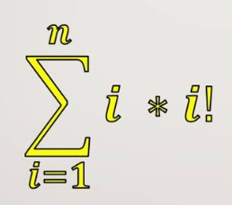

# Somatorio-com-fatorial
Este projeto consiste em um programa desenvolvido em *C++* para calcular o valor da soma da série matemática descrita abaixo, permitindo que o usuário defina o limite superior ($n$). E chegue no resultado.

---

## 📐 Fórmula Matemática

O objetivo é calcular a seguinte somatória:

---

## 🛠️ Tecnologias Utilizadas

- *Linguagem:* C++
- *Compilador recomendado:* g++ (GCC) / Clang / MSVC

---
